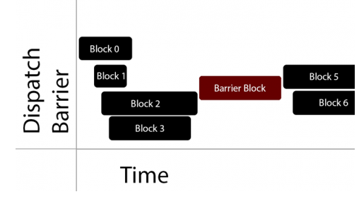

###GCD其他技术总结

####dispatch_barrier_async
这个函数正如名字一样，是个隔栏。  
假如有一个资源需要读写，如果正在读的时候进行写入或者正在写入的时候进行读取，会造成数据的混乱。  
GCD提供了这个优雅的方案--使用dispatch barriers创建读写锁  

	dispatch_async(queue,blk0_for_reading);
	dispatch_async(queue,blk1_for_reading);
	dispatch_async(queue,blk2_for_reading); 
	dispatch_barrier_async(queue,blk_for_writing); //写入
	dispatch_async(queue,blk3_for_reading); 
	dispatch_async(queue,blk4_for_reading); 
	dispatch_async(queue,blk5_for_reading); 
	
此函数非常简单，只有当前3个reading block读取完毕，dispatch_barrier_async才会开始执行写功能，在写功能没有完成之前，后面的3个读block不会执行，只有当写功能block执行完毕后才会执行后续的写功能block。  
流程图 如图所示：  

注意事项：  

 * Custom Serial Queue: 这是一个坏的选择，barriers不会做任何有用的事情。因为一个serial queue 本身就是一次只执行一个操作
 * Global Concurrent Queue: 在这里用要小心，这可能不是一个好主意，因为系统的其他位置也使用了这个queue而且你也不想为了你的目标而独占他，是吧？
 * Custom Concurrent Queue: 这是一个最好的选择用于原子操作或临界区代码。你要设置或安装的任何需要线程安全的地方，这个barrier是最好的候选人。
 
 
###Dispatch Groups
假如需求，要求多个Dispatch Queue全部执行完毕后才执行最后一个任务，这个Dispatch Queue 既有Concurrent Queue，又有Serial Queue ，此时该如何处理？  

方法一：

	dispatch_queue_t concurrentQueue = dispatch_queue_create("gcd.concurrent-1",DISPATCH_QUEUE_CONCURRENT);
	
    dispatch_group_t group = dispatch_group_create();
   
    dispatch_group_async(group, concurrentQueue, ^{NSLog(@"block1");});
    dispatch_group_async(group, concurrentQueue, ^{NSLog(@"block2");});
    dispatch_group_async(group, concurrentQueue, ^{NSLog(@"block3");});
    
    dispatch_group_notify(group, dispatch_get_main_queue(), ^{
        NSLog(@"group done");
    });
    
如代码所示，你可以把block任务放入queue，再把这个queue放入一个group中。当这个group中的所有队列内的所有任务执行完毕，会调用dispatch_group_notify内的block。

方法二：  
使用：  
	dispatch_group_t group = dispatch_group_create()  
	dispatch_group_enter(group)  
	dispatch_group_leave(group)  
	这三个函数
	
	
	    dispatch_async(dispatch_get_global_queue(DISPATCH_QUEUE_PRIORITY_HIGH, 0), ^{
        
        dispatch_group_t group = dispatch_group_create();
        
        dispatch_queue_t dispatchQueue = dispatch_queue_create("gcd.concurrent-1", DISPATCH_QUEUE_CONCURRENT);
        
        for (NSInteger i = 0; i < 30; i++) {
            
            dispatch_group_enter(group);
            sleep(1);
            dispatch_async(dispatchQueue, ^{
                NSLog(@"i = %ld",i);
                dispatch_group_leave(group);
            });
        }
        
        dispatch_group_notify(group, dispatch_get_main_queue(), ^{
            NSLog(@"downloadGroup done");
        });
       
        
    });
    
这里dispatch group 相当于一个计数器，统计未完成的任务  
dispatch_group_enter 这个group +1   
dispatch_group_leave 该 group -1 两个函数要配对出现   
当group内的值为0，意味着该group的所有任务处理完毕，系统会调用dispatch_group_notify 内的block作为完结  

###Semaphores
简单来说Semaphores就像一个车库门口的牌子，牌子上显示还有几个停车位。假如里面有3个车位，牌子上显示3.这时有2个车来了，进去停车，牌子上显示为1.如果又来了3辆车，那么只有一辆车进去，牌子上显示为0.而另外两辆车要在门口等待。如果有一辆车离开车库，牌子上会显示为1，意思里面有空车位。外面的一辆车就可以开进去，牌子又为0.就这样车子可以认为是线程，牌子就是Semaphores。  

dispatch_semaphore_create　　　创建一个semaphore 和信号的总量  
dispatch_semaphore_signal　　　发送一个信号 信号总量加1  
dispatch_semaphore_wait       等待信号，当信号总量少于0的时候就会一直等待，否则就可以正常的执行，并让信号总量-1   
	
	　　　　
	dispatch_semaphore_t semaphore = dispatch_semaphore_create(10);   
	dispatch_queue_t queue = dispatch_get_global_queue(DISPATCH_QUEUE_PRIORITY_DEFAULT, 0);   
	for (int i = 0; i < 100; i++)   
	{   
		dispatch_semaphore_wait(semaphore, DISPATCH_TIME_FOREVER);   
		dispatch_group_async(group, queue, ^{   
            NSLog(@"%i",i);   
            sleep(2);   
            dispatch_semaphore_signal(semaphore);   
        });   
    }
    dispatch_group_wait(group, DISPATCH_TIME_FOREVER);  

创建了一个初使值为10的semaphore，每一次for循环都会创建一个新的线程，线程结束的时候会发送一个信号，线程创建之前会信号等待，所以当同时创建了10个线程之后，for循环就会阻塞，等待有线程结束之后会增加一个信号才继续执行，如此就形成了对并发的控制，如上就是一个并发数为10的一个线程队列。  

参考文章：  
[https://www.raywenderlich.com/60749/grand-central-dispatch-in-depth-part-1](https://www.raywenderlich.com/60749/grand-central-dispatch-in-depth-part-1)  
[https://www.raywenderlich.com/63338/grand-central-dispatch-in-depth-part-2](https://www.raywenderlich.com/63338/grand-central-dispatch-in-depth-part-2)

