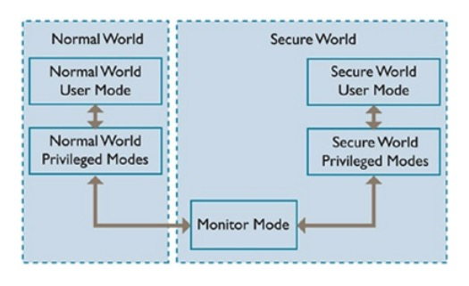

#Understanding iOS Security:Part 1  
Apple使用ios用于启动移动设备。从一开始，安全就是iOS的核心，有许多内置功能在不同级别用于加强设备安全和资源。这篇文章意在回答以下这些问题:  

* 当iPhone启动的时候发生了什么？  
* 数据如何在iOS里存储  
* 如果设备被偷，黑客是否可以看见和修改个人数据？  
* 如何加强隐私控制  

##Boot level security mechanism  
在桌面电脑时代，一个攻击者可以在没有任何密码系统知识下就能够访问硬盘。比如，他能把硬盘移到别的系统上并且读取数据，或者通过CD启动另外一个系统。那iphone呢？攻击者能否通过移除芯片或加载另一个系统来访问数据？在正常环境下是不太可能的！  

这是因为iOS设备不会加载非aplle签名的固件，观察一下引导时的安全机制可以帮助我们理解他。所以，当你开机的时候发生了什么？

	1.当iOS开机时，处理器会立刻执行boot ROM的代码。这里boot ROM的代码在芯片构建时就设计好了，并且毫无疑问是可信赖的。boot ROM内包含apple的root证书，用于下一步的加载过程中的检查签名。
	2.在签名检查过后，LLB（Low Level Boot loader）会被加载。LLB完成任务并进行下一步的引导操作。iBoot
	3.iBoot认证和run iOS kernel。
	
如上，每一步的操作都有一个代码签名完成。这就称为“证书链”，因此，在普通环境下，证书链确定iOS泡在一个正确唯一的机子里，确定手机没有被加载到其他操作系统上。 
	
  

boot ROM里有几个漏洞是可以被利用的，不仅可以刷boot loader，而且还能绕过每一步的代码签名。记住如果一个link被损坏，会导致其他link都被损坏。

##Secure Enclave  
指纹解锁，apple声称指纹信息会被加密保存在一个叫“Secure Enclave”地方，而且绝不会被备份进任何apple server。那么Secure Enclave是什么？他如何工作？Secure Enclave是一个协处理器，处于主处理器里。所有的数据密码的工作都在这里处理。Secure Enclave这个概念和类似于ARM的信任区技术。

  

如图，一个被称为“secure mode”的模块被加载进处理器中，简单说，就是有两个处理器架构被装在一个设备里。第一个是普通的ios app（user mode）第二个是只执行受信任的代码（secure mode）。数据被写入RAM里时，处于安全监控模式下的user mode是无法访问的。这篇博客[链接](http://blog.fortinet.com/2013/09/16/iphone5s-inside-the-secure-enclave)解释了在指纹解锁时Secure Enclave是如何工作  
* 用户按下手指  
* 锁屏服务调用secure world的api 
* 处理器转到secure world  
* 描述bit从传感器转移到处理器
* 数据无法被任何app偷窥和修改，因为这个处理在secure mode下，而非user mode  
* 必要的密码认证处理完毕&授予访问权限  

##Code Signing  
   Apps对于移动系统是个非常重要的组件。apple相信强制严格的安全级别对于整个设备的安全是非常重要的。代码签名是一步。简单来说，apple不允许在其跑未授权的app。确保所有app可信，授权，和没有被篡改。总之，以上讨论的证书链是从boot loader到OS再到app。
   如果公司要使用 in house app，他们需要申请iOS Developer Enterprise program (iDEP)。一旦公司成为iDEP，需要注册获取 Provisioning Profile。In-house apps 会在运行期间检查签名的有效性，带有已过期和失效的apps是不能跑的。 
   
     
   
   本章我们讨论了三个主要安全功能，secure boot process, Secure Enclave, application signing。下一章我们会看看其他功能，比如数据保护，加密等等。 ‘Til then, Happy Hacking! 